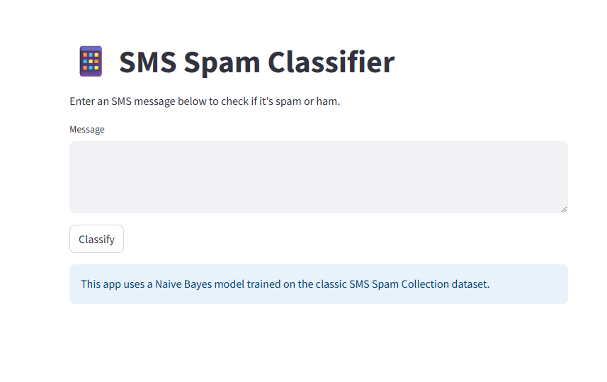

This is a machine learning-powered web app built with Streamlit that classifies SMS messages as spam or ham (not spam). It uses a Multinomial Naive Bayes model trained on the classic SMS Spam Collection Dataset, with TF-IDF vectorization to transform text messages into numerical features. The app provides an easy-to-use interface for real-time message classification along with prediction confidence.

🛠️ SMS Spam Classifier — Setup Instructions
📦 Requirements
Python 3.8 or newer

Git

Recommended: Virtual environment tool (venv or conda)

🔧 Local Setup (for Development or Testing)
1. Clone the Repository
bash
Copy
Edit
git clone https://github.com/your-username/sms-spam-classifier.git
cd sms-spam-classifier
2. (Optional) Create and Activate a Virtual Environment
bash
Copy
Edit
# macOS/Linux
python3 -m venv venv
source venv/bin/activate

# Windows
python -m venv venv
venv\Scripts\activate
3. Install Dependencies
bash
Copy
Edit
pip install -r requirements.txt
4. Run the App
bash
Copy
Edit
streamlit run app.py
Your app will launch in the browser at:
👉 http://localhost:8501

Below is the image of the UI
